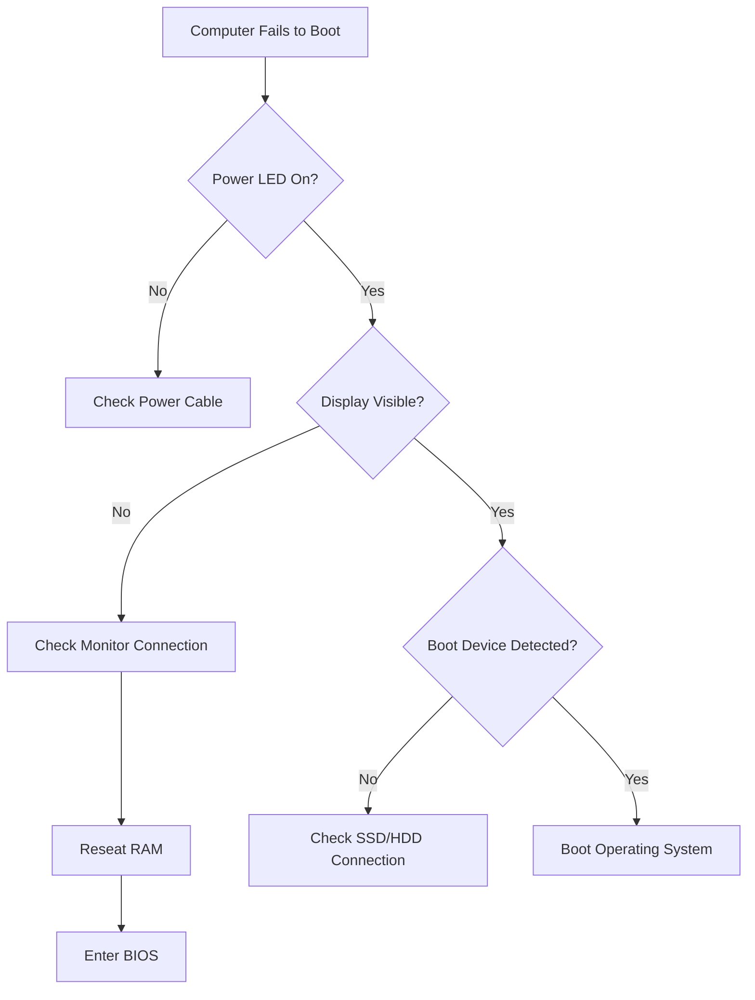

# Hardware Diagnostic Flow

```mermaid
flowchart TD
    A[Computer Fails to Boot] --> B{Power LED On?}

    B -->|No| C[Check Power Cable]
    B -->|Yes| D{Display Visible?}

    D -->|No| E[Check Monitor Connection]
    E --> F[Reseat RAM]
    F --> G[Enter BIOS]

    D -->|Yes| H{Boot Device Detected?}

    H -->|No| I[Check SSD/HDD Connection]
    H -->|Yes| J[Boot Operating System]
```
