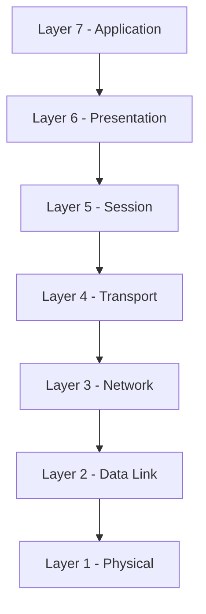

# OSI Model

```mermaid
graph TD

A[Layer 7 - Application]
B[Layer 6 - Presentation]
C[Layer 5 - Session]
D[Layer 4 - Transport]
E[Layer 3 - Network]
F[Layer 2 - Data Link]
G[Layer 1 - Physical]

A --> B --> C --> D --> E --> F --> G
```
